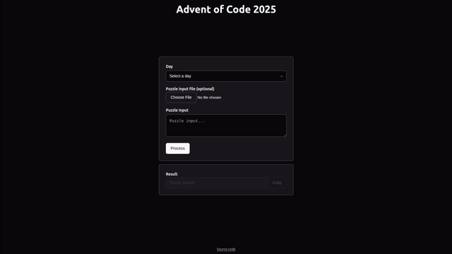

# Advent of Code - JS Template
Template with frontend for Advent of Code solutions written in JavaScript.



## Development
Run `index.html` in a local server.

## Structure
Solution classes can be placed in `javascript/solutions/`:
```
javascript/
├─ solutions/
│  ├─ day1/
│  │  ├─ part1.js
│  │  ├─ part2.js
│  ├─ day2/
│  │  ├─ part1.js
│  ├─ .gitkeep
```

The solution class must extend from `Solution`, and implement a public `process` method:
```javascript
// javascript/solutions/day1/part1.js

import Solution from '../../Solution.js';

export default class extends Solution {
  process() {
    // return result of processing `this.input`
  }
}

```

Lastly, it must be mapped to the correct day and part in `javascript/SOLUTION_CLASSES_MAP.js`:
```javascript
// javascript/SOLUTION_CLASSES_MAP.js

import day1part1 from './solutions/day1/part1.js';
import day1part2 from './solutions/day1/part2.js';
import day2part1 from './solutions/day2/part1.js';

export default {
  1: {
    1: day1part1,
    2: day1part2,
  },
  2: {
    1: day2part1,
  },
}

```

## Credits
- Theme and UI components from
  <a href="https://oat.ink/" target="_blank" rel="noopener noreferrer">Oat UI</a>
- Animations from
  <a href="https://oat-animate.dharmeshgurnani.com/" target="_blank" rel="noopener noreferrer">Oat Animate</a>
